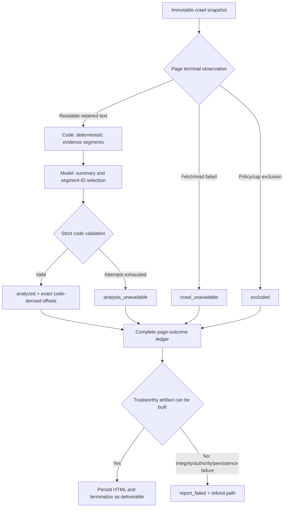

# Paid V4 Page Outcomes and Report Terminalization Implementation Plan

> **For agentic workers:** Execute this plan inline under the repository scope lock. Do not delegate, deploy, run a real report, or perform Git writes without separate authority.

**Goal:** Make every prospective Paid V4 page attempt a reportable GEO outcome, prevent one page failure from failing the whole report, and reserve `report_failed` for genuine system/integrity failures.

**Architecture:** Preserve the immutable pre-admission crawl snapshot as the source of crawl facts. Let the configured model own semantic summarization and evidence selection, but let deterministic code own evidence segmentation, exact offsets, page-outcome aggregation, report status, persistence, and commercial terminalization. Produce and deliver an HTML artifact even when all pages are unreachable or some internal analysis sections are unavailable.

**Tech Stack:** TypeScript, Next.js/React, npm workspaces, Vitest, PostgreSQL repositories, immutable V4 HTML artifacts.

## Global Constraints

- Prospective Paid V4 only. Do not mutate, replay, resume, clone, or repair a historical report/job/order.
- No schema or migration change: crawl outcomes already exist in the immutable site snapshot; successful analyses already exist in immutable page summaries; the final artifact persists the complete terminal page ledger.
- No heuristic summary, fuzzy evidence search, offset clamp, fabricated evidence, silent fallback, extra model attempt, provider/model change, or token-limit change.
- Crawl unavailability is a GEO observation. Internal page-analysis unavailability is a product degradation and must be labelled separately.
- `report_failed` remains valid only when no trustworthy customer artifact can be committed or terminalized because of integrity, identity, authority, persistence, security, or artifact-generation failure.
- Automated checks do not authorize or prove a real model run, payment, refund, email, deployment, or Protected Staging acceptance.

## Execution graph

## Change inventory

### 1. Deterministic evidence selection boundary

**Production:**

- Modify `apps/web/src/report-v4/mimo-site-synthesis-provider.ts`.

**Tests:**

- Modify `apps/web/src/report-v4/mimo-site-synthesis-provider.test.ts`.
- Modify `apps/web/src/worker/report-v4-page-analysis-production.test.ts` only if adapter-level retry/persistence coverage is not already sufficient.

**Required behavior:**

- Split exact retained UTF-16 text into bounded stable segments.
- Ask the model for semantic chunks plus supplied segment IDs, never offsets.
- Reject unknown IDs, duplicates where prohibited, extra fields, malformed ordering, empty/over-budget selections, and model-supplied offsets.
- Map accepted IDs to exact `startOffset`/`endOffset`, then pass the unchanged persisted page-summary contract through its existing parser.
- Preserve the current classified correction attempt count.

### 2. Public V4 artifact contract for page outcomes

**Production:**

- Modify `packages/ai-report-engine/src/combined-geo-report-v4.ts`.

**Tests:**

- Modify `packages/ai-report-engine/src/combined-geo-report-v4.test.ts`.

**Required behavior:**

- Add a strict, ordered page ledger with exactly these mutually exclusive statuses: `analyzed`, `crawl_unavailable`, `excluded`, `analysis_unavailable`.
- Add aggregate counts that must exactly match the ledger.
- Preserve URL identity and expose only safe observation reason codes/text; never expose internal exceptions or secrets.
- Make website synthesis an explicit available/unavailable union so an all-unreachable site never receives fabricated model prose.
- Treat an all-unreachable site as report content (`status: unavailable`), not absence of a report artifact.

### 3. Partial page analysis without all-or-nothing failure

**Production:**

- Modify `apps/web/src/db/report-v4-page-summaries.ts`.
- Modify `apps/web/src/worker/report-v4-core-production.ts`.

**Tests:**

- Modify `apps/web/src/db/report-v4-page-summaries.test.ts`.
- Modify `apps/web/src/worker/report-v4-core-production.test.ts`.
- Modify `apps/web/src/worker/report-v4-core-production.postgres.test.ts` only for the authoritative PostgreSQL lineage path.

**Required behavior:**

- Replace page-analysis `Promise.all` failure propagation with bounded per-page settlement.
- Reuse and persist every valid page summary exactly as today.
- Load the exact successful subset for website synthesis while proving it is a subset of the immutable analyzable-page lineage with no extra rows.
- Record exhausted page-analysis failures only as `analysis_unavailable` in the final artifact; do not relabel them as crawl failures.
- Allow zero analyzable pages to continue to artifact construction.
- Run website synthesis only when at least one valid page summary exists.

### 4. Always build a trustworthy report artifact

**Production:**

- Modify `apps/web/src/worker/report-v4-orchestrator.ts`.

**Tests:**

- Modify `apps/web/src/worker/report-v4-orchestrator.test.ts`.
- Modify `apps/web/src/worker/report-v4-core-acceptance.ts` and `apps/web/src/worker/report-v4-core-acceptance.test.ts` only where the existing acceptance observer assumes every page/model section must succeed.

**Required behavior:**

- Build the page ledger from the immutable snapshot plus page-analysis settlements.
- Do not return `coreReport: null` merely because the snapshot is unavailable or all three questions are unavailable.
- Persist and ready one HTML artifact for `completed`, `completed_limited`, and content-level `unavailable` reports.
- Status rules:
  - Crawl failures/exclusions are observations and do not by themselves downgrade fulfillment.
  - Internal missing model sections produce `completed_limited`.
  - All crawl attempts unavailable may produce report content status `unavailable`, while remaining a completed commercial deliverable.
- Preserve enhancement immutability and prevent diagnosis from replacing the core page ledger or website synthesis.

### 5. Separate deliverable outcomes from true `report_failed`

**Production:**

- Modify `apps/web/src/db/public-source-commerce.ts`.
- Modify `apps/web/src/components/payment-return.ts` only if the final limited-delivery terminal state otherwise cannot hand the customer to the artifact.
- Modify `apps/web/src/commerce/operations.ts` only if a limited-delivery access token is otherwise omitted from its email delivery URL.

**Tests:**

- Modify `apps/web/src/db/public-source-commerce.test.ts`.
- Modify `apps/web/src/db/public-source-commerce.postgres.test.ts`.
- Modify `apps/web/src/components/payment-return-banner.test.ts` and/or `apps/web/src/commerce/operations.test.ts` only for changed customer access behavior.

**Required behavior:**

- Remove the no-artifact `all_questions_unavailable` commercial terminalizer from the normal V4 core path.
- Map content-level `unavailable` to a commercially completed, settled, accessible report.
- Keep `completed_limited` as an artifact-bearing terminal state; if the existing limited-report refund policy remains, the refund must not suppress report access.
- Issue access and queue an artifact-bearing terminal email for every valid persisted core artifact.
- Keep generic `terminalizeFailedPaidReportV4Core` fail-closed and use it only for uncaught true system/integrity failures before any customer artifact exists.
- Do not change historical refund rows, emails, or failed jobs.

### 6. Render the GEO observation instead of a failure page

**Production:**

- Modify `apps/web/src/components/combined-geo-report-v4-artifact.tsx`.

**Tests:**

- Modify `apps/web/src/components/combined-geo-report-v4-artifact.test.tsx`.
- Modify `apps/web/src/report/report-v4-html.test.ts` only if the composed HTML contract needs direct coverage.

**Required behavior:**

- Add a crawl-coverage section with totals and one ordered row per page.
- Clearly distinguish `crawl_unavailable`, `excluded`, and `analysis_unavailable` in Chinese and English.
- When website synthesis is unavailable, render the factual limitation and page observations; do not render invented strengths, gaps, or actions.
- Do not claim that all AI crawlers are blocked unless the stored observation specifically establishes that; identify the Open GEO probe/read outcome precisely.

## TDD and verification sequence

1. Add focused failing tests for segment-ID mapping and malformed responses; run `npm test -- --run apps/web/src/report-v4/mimo-site-synthesis-provider.test.ts apps/web/src/worker/report-v4-page-analysis-production.test.ts` and record the expected red.
2. Implement Task 1 and rerun those tests green.
3. Add failing parser tests for the page ledger, aggregate mismatches, safe reasons, and unavailable website synthesis; run the focused `packages/ai-report-engine` V4 contract test and record red.
4. Implement Task 2 and rerun green.
5. Add failing core tests for one failed page, all page analyses failed, and zero crawl-readable pages; implement Tasks 3 and 4; rerun the focused unit and PostgreSQL tests.
6. Add failing commerce tests proving content-level unavailable receives an active artifact/access and true internal failure still receives `report_failed`; implement Task 5; rerun focused commerce and handoff tests.
7. Add failing renderer tests for mixed outcomes and all-unreachable observations; implement Task 6; rerun focused renderer/HTML tests.
8. Run relevant workspace tests, `npm run lint`, `npm run build`, `npm run test:postgres:disposable` for the selected semantic-contract tests, `git diff --check`, `codegraph sync`, and `codegraph status`.
9. Re-read the complete diff against `docs/ACTIVE-CHANGE-SCOPE.md`. Stop on any unlisted production path or behavior.

## Acceptance scenarios

1. Five pages, four analyzed and one crawl-unavailable: report is delivered; page five is a GEO observation; no `report_failed`.
2. Five readable pages, four analyzed and one model contract exhausted: report is delivered as limited; page five says internal analysis unavailable, not crawler blocked; no generic failed-report email.
3. Every attempted page is crawl-unavailable: a factual HTML report is delivered with the complete page ledger and no fabricated synthesis; commerce is completed, not failed.
4. All three business questions are unavailable but crawl observations exist: an artifact is still delivered; no no-artifact failure terminalization.
5. Artifact identity, persistence, or atomic commerce validation fails: no untrusted artifact is exposed; the existing true `report_failed` refund boundary remains fail-closed.

---

## Audit-repair amendment (2026-08-08)

This amendment supersedes the earlier implementation sequence where the audit
found a conflict. Execute inline only after the expanded `FROZEN` scope is
explicitly approved. Do not commit, deploy, or run a real report.

### Task 7: Align page-ledger cardinality with snapshot authority

**Files:**

- Modify `packages/ai-report-engine/src/combined-geo-report-v4.ts`.
- Test `packages/ai-report-engine/src/combined-geo-report-v4.test.ts`.
- Test `apps/web/src/worker/report-v4-admission-runtime.test.ts`.
- Test `apps/web/src/components/combined-geo-report-v4-artifact.test.tsx`.

**Interfaces:**

- Consume the existing ordered `ReportV4SiteSnapshotBundle.pages` authority.
- Keep `CombinedGeoReportV4PageCoverage.pages` as the exact ordered terminal
  ledger and bound it to `50_000`, the existing discovered-URL ceiling.

- [ ] Add a parser test with 51 ordered outcomes and assert acceptance.
- [ ] Add a parser test with 50,001 outcomes and assert fail-closed rejection.
- [ ] Replace the hard-coded 50-outcome limit with an exported artifact ledger
      ceiling of 50,000; do not weaken URL, ordinal, uniqueness, count, or reason
      validation.
- [ ] Render a representative 51-plus-page fixture and assert the final row and
      exact counts are visible without truncating the persisted ledger.
- [ ] Run the contract, admission, and renderer tests and record red/green.

### Task 8: Type provider degradation and preserve system failures

**Files:**

- Modify `apps/web/src/worker/report-v4-page-analysis-production.ts`.
- Modify `apps/web/src/worker/report-v4-website-synthesis-production.ts`.
- Modify `apps/web/src/worker/report-v4-core-production.ts`.
- Test `apps/web/src/worker/report-v4-page-analysis-production.test.ts`.
- Test `apps/web/src/worker/report-v4-website-synthesis-production.test.ts`.
- Test `apps/web/src/worker/report-v4-core-production.test.ts`.
- Test `apps/web/src/worker/report-v4-core-production.postgres.test.ts`.

**Interfaces:**

- Produce `ReportV4PageAnalysisUnavailableError` only after the configured
  provider attempt boundary is exhausted for provider transport/response
  failures.
- Produce `ReportV4WebsiteSynthesisUnavailableError` only after the provider
  failure checkpoint is durably recorded.
- Configuration, token-budget, abort, identity, lineage, repository, database,
  persistence, and checkpoint failures remain their original errors.

- [ ] Add a red page-analysis test: invalid provider output after the existing
      attempts throws the typed degradation error.
- [ ] Add red counter-tests: `loadExactSummary` lineage failure and `persist`
      failure retain their exact errors.
- [ ] Wrap only the provider call boundary in the typed page degradation;
      perform identity validation and persistence outside that classification.
- [ ] In core settlement, convert only the typed page degradation to
      `analysis_unavailable`; rethrow every other rejected result before website
      synthesis or artifact persistence.
- [ ] Add equivalent website-synthesis red tests: provider exhaustion becomes
      the typed error, while repository `fail`/`complete` errors propagate.
- [ ] Extend the website-synthesis union with
      `reason: "website_synthesis_unavailable"`; core catches only the typed
      website error and retains the page ledger/questions.
- [ ] Run focused unit and PostgreSQL tests and record red/green.

### Task 9: Lock the status matrix and commercial recovery

**Files:**

- Modify `packages/ai-report-engine/src/combined-geo-report-v4.ts`.
- Modify `apps/web/src/worker/report-v4-orchestrator.ts`.
- Modify `apps/web/src/db/public-source-commerce.ts`.
- Test `packages/ai-report-engine/src/combined-geo-report-v4.test.ts`.
- Test `apps/web/src/worker/report-v4-orchestrator.test.ts`.
- Test `apps/web/src/db/public-source-commerce.test.ts`.
- Test `apps/web/src/db/public-source-commerce.postgres.test.ts`.

**Status matrix:**

| Page/business content | Root content status | Commerce |
|---|---|---|
| No readable page, 3 answered questions | `unavailable` | `completed` |
| No readable page, fewer than 3 answered | `completed_limited` | `completed_limited` |
| Any page/website internal analysis unavailable | `completed_limited` | `completed_limited` |
| Website available, no internal gap, 3 answered | `completed` | `completed` |

- [ ] Add all four matrix rows as failing orchestrator tests.
- [ ] Make `coreStatus` evaluate question/internal degradation before assigning
      the special all-crawl-unavailable content status.
- [ ] Add parser cross-invariants so forged `completed` payloads with unavailable
      questions, page analysis, or website synthesis are rejected.
- [ ] Update terminal replay admission to use `requireV4CommerceOutcome` rather
      than rejecting raw `unavailable` content status.
- [ ] Add a PostgreSQL recovery test for an exact unavailable artifact and prove
      zero regeneration/model calls.
- [ ] Remove the newly introduced unused `_label` parameter and rerun lint.

### Task 10: Repair probe and evidence-boundary tests

**Files:**

- Modify `apps/web/src/scripts/probe-free-v4-direct-semantics.ts`.
- Modify `apps/web/src/scripts/probe-free-v4-direct-semantics.test.ts`.
- Modify `apps/web/src/report-v4/mimo-site-synthesis-provider.test.ts`.
- Modify `apps/web/src/worker/report-v4-core-acceptance.test.ts` only if its
  declared observer assertions still encode all-or-nothing page success.

- [ ] Add `status: "available"` and one analyzed homepage ledger to the probe's
      core report envelope; the enhancement spread must preserve it unchanged.
- [ ] Replace the short mojibake segmentation fixture with an explicit string
      containing CRLF, JSON escape characters, Chinese, and a real `\u{1F604}`
      positioned across the 320 UTF-16 boundary.
- [ ] Assert every mapped offset slices back to the exact supplied segment and
      never splits the surrogate pair.
- [ ] Independently reject duplicate IDs, unknown IDs, non-string IDs, more
      than 8 IDs, more than 8 chunks, model-supplied offsets, and extra fields.
- [ ] Run the probe and evidence tests and record red/green.

### Task 11: Gate historical V4 compatibility with current data

**Files:**

- Read only; no production file is authorized by this task.

- [ ] Use the configured current database identities only after confirming the
      environment marker; query counts only for active
      `combined_geo_report_v4` payloads missing `websiteSynthesis.status` or
      `pageCoverage`.
- [ ] Do not output payloads, URLs, customer identifiers, tokens, or secrets.
- [ ] If both counts are zero, record that prospective strict parsing is safe
      for the checked environments.
- [ ] If either count is nonzero, stop. Create a new `FROZEN` compatibility
      proposal; do not synthesize legacy coverage or edit `combined-reports.ts`.

### Task 12: Resolve the four independent V3 baseline failures

**Files:**

- Modify `apps/web/src/db/combined-reports.test.ts`.
- Modify `apps/web/src/db/combined-replacement-terminalization.test.ts`.
- Modify `apps/web/src/worker/paid-v3-semantic-review.test.ts`.
- Conditionally modify
  `packages/ai-report-engine/src/report-semantic-review-manifests.ts` only after
  an isolated real protected-field mutation is accepted by the verifier.

- [ ] Restore the V3 loader mock's exact crawl-diagnostic exports and rerun the
      two loader failures.
- [ ] Update the stale generative `source_limited` expectation to the current
      artifact-bearing `completed_limited` product contract; do not change V3
      production commerce.
- [ ] Split the semantic-review tamper loop into named tests and prove each
      mutation actually changes its canonical hash before expecting rejection.
- [ ] If all real mutations reject, change tests only. If one real mutation is
      accepted, demonstrate red first and minimally bind that projection in the
      allowlisted verifier.
- [ ] Run the four V3 files, then the full workspace suite.

### Final verification

- [ ] Run focused V4 unit tests and selected PostgreSQL tests.
- [ ] Run `npm test`; require no newly introduced failure and resolve the four
      named V3 baselines.
- [ ] Run `npm run lint`, `npm run build`, `git diff --check`, `codegraph sync`,
      and `codegraph status`.
- [ ] Recalculate production/test diff budgets and compare every path with the
      approved allowlist.
- [ ] State explicitly that real model, report, payment/refund/email, customer,
      deployment, and Protected Staging acceptance remain unverified.
