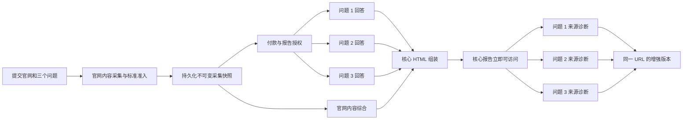

# 两阶段 GEO 报告生成简化设计

**日期：** 2026-07-16

**状态：** 已批准设计，尚未实施

**范围：** 启用本设计后新创建的标准深度报告

**前瞻合同：** `combined_geo_report_v4`

**可执行需求注册表：** `config/report-contracts/combined-geo-report-v4.requirements.json`

**目标用户：** 企业负责人、市场运营和网站运营为主；GEO 专业人员为次级用户

## 1. 决策

Open GEO Console 的标准报告生成链路重构为两个独立阶段：

1. **核心报告：** 复用付款前的网站采集结果，分别回答三个用户问题，为每个问题保留最相关的五个来源，然后立即交付 HTML 报告。
2. **诊断增强：** 核心报告交付后，分别分析三个问题为什么采用这些来源、目标官网缺少什么，并在同一报告地址追加增强版本。

系统不再把网站采集、公开搜索、来源验证、来源诊断、PDF 和商业终态串成一个必须全部成功的长事务。一个增强步骤失败，不得撤回已经生成的答案和来源。

模型负责根据证据动态撰写自然、专业的客户内容；代码负责输入边界、结构契约、证据绑定、Token 预算、安全和质量验证。代码不得通过大量固定句式代替模型表达能力。

## 2. 被修正的问题

当前未来报告主链把多个性质不同的步骤绑定为一个成功条件，并使用重试、替换任务和复杂状态跳转修补局部失败。实际结果是：

- 三个答案本身可在很短时间内完成，但报告可能经过多轮来源、声明、快照、资格和替换处理；
- 已成功的答案会因后续证据步骤失败而被重新调用或整份撤回；
- 确定性的不满足条件被错误归类为临时错误，产生无意义重试；
- 客户先看到内部处理复杂度，而不是答案、来源和行动建议；
- 报告内容过长，跨问题来源分析削弱了每个问题自己的因果链；
- PDF 排版和就绪检查增加运行成本，却不是当前客户需要的交付物；
- 模型提示词、内部状态和技术术语可能泄漏到客户报告；
- 固定文案和防御规则持续增加，使模型输出僵硬且难以维护。

本设计从产品合同和执行边界上消除这些原因，不继续为旧主链增加补丁。

## 3. 产品合同

一次标准报告只承诺完成以下事项：

1. 接收一个目标官网 URL。
2. 收集该官网中 AI 模型可访问、可分析的公开同站 HTML 页面。
3. 接收并保存用户提出的三个问题。
4. 分别回答三个问题。
5. 在每个答案下展示与该问题相关的前五个来源。
6. 分别解释这些来源为什么能支持当前答案、其他公司或网站为什么被采用、目标官网需要补齐什么。
7. 以 HTML 交付报告；诊断增强可稍后追加到同一个报告地址。

付款、报告权限、访问令牌、邮件、退款和信用额度保持现有商业边界，不参与内容生成架构重写。

## 4. 非目标

- 不复制整站，不追求抓取浏览器或爬虫能看到的一切文件。
- 不分析 PDF、Word、视频、登录后页面或下载文件的正文。
- 不支持超过 50 个可分析 HTML 页面的标准官网。
- 不反向推断模型或搜索服务的隐藏排名权重。
- 不保证采取建议后一定被未来模型引用。
- 不自动切换模型供应商以掩盖失败。
- 不为新报告生成客户 PDF，也不以 PDF 就绪作为报告完成条件。
- 不迁移、重写或删除历史报告、历史 PDF 字段和历史存储文件。
- 不把 SEO 当作 GEO 的同义词，不在客户报告中生成 SEO 建议或 SEO 术语。

## 5. GEO 术语和用户表达

### 5.1 唯一专业语境

客户报告始终处于 GEO 语境，围绕以下概念表达：

- 生成式答案中的可见性；
- AI 对官网信息的访问和理解；
- 问题与页面内容的匹配；
- 实体、服务、场景、条件和事实的清晰程度；
- 来源为什么能成为生成式答案的可用材料；
- 目标官网如何提高被理解、引用或采用的可能性。

报告不得自行引入“SEO 优化”“搜索排名”“关键词排名”等 SEO 语言，也不得用 SEO 替代 GEO。即使某项改善同时可能影响传统搜索，客户报告仍只描述经过本报告证据支持的 GEO 效果。

外部来源的原始标题或必要证据中若自然包含 `SEO`，可以原样保留，但模型不得据此扩展为 SEO 诊断。该例外只适用于来源原文，不适用于报告分析和建议。

### 5.2 面向业务用户

默认阅读顺序为“结论 → 原因 → 行动”。客户可见文本应使用业务语言，不暴露：

- 系统提示词或任务指令；
- 原始模型 JSON；
- checkpoint、snapshot、claim extraction、provider adapter 等内部术语；
- Token 预算、重试计数、供应商响应结构；
- 内部证据 ID、哈希或状态机节点。

GEO 专业人员需要的详细来源摘录、验证状态和证据关系保留在折叠区域“查看详细依据”中。

## 6. 官网可分析内容的定义

### 6.1 纳入范围

“抓全官网”定义为：在标准产品容量内，收集目标官网公开可发现、能转化为模型可分析正文的同站 HTML 页面全集。

发现入口包括：

- 用户提交的规范化首页；
- 网站 sitemap 中的同站 HTTP(S) URL；
- 已访问 HTML 页面中的公开同站内部链接。

URL 需要规范化、去片段、去安全无关跟踪参数并去重。重定向后必须继续满足同站和公开网络安全规则。

### 6.2 读取策略

每个候选 HTML 页面最多采用两步读取：

1. 首先读取原始 HTML，清理导航、页脚、Cookie 提示、重复模板和无意义脚本样式。
2. 如果原始 HTML 没有足够的可分析正文，只执行一次浏览器渲染回退。

浏览器回退后仍没有可分析正文时，跳过该页面，并记录为“AI 访问或理解受限”的 GEO 缺口。该页面不得触发整站或整份报告重试。

页面需记录 `direct_readable` 或 `js_dependent`，使报告可以说明 AI 直接读取能力，而不把 JS 页面一律判断为失败。

### 6.3 排除范围

下列内容不读取正文：

- PDF；
- Word 或其他办公文档；
- 视频、音频和压缩包；
- 登录、验证码、付费墙后的内容；
- 非 HTML 下载文件；
- 跨站页面。

公开页面中指向这些文件的链接可作为页面事实被记录，但不会进入标准报告正文分析。

### 6.4 页面数量准入

- 发现 1–50 个可分析 HTML 页面：标准产品全部分析。
- 尚未发现可分析页面：标准 GEO 报告不可用，不进入付款后的核心报告生成；向用户说明该官网当前没有 AI 可分析的公开 HTML 内容。
- 发现第 51 个可分析 HTML 页面：停止标准准入，不继续用截断样本冒充全站分析；向用户展示大型官网定制服务或联系入口。

页面数量按“最终可分析 HTML 页面”计算，不按候选 URL、失败 URL 或排除文件计算。

### 6.5 付款前复用

准入阶段生成并持久化不可变的网站采集快照，包括页面清单、规范化 URL、读取方式、正文摘要、内容哈希、排除原因和采集时间。付款后的核心报告必须复用该快照，不重新抓取官网。

只有用户新建报告或采集快照根据明确的产品时效规则过期时，才创建新的采集任务；恢复同一报告不得静默换用新快照。

## 7. 两阶段架构



### 7.1 核心阶段

核心阶段由四类输入组成：

- 不可变官网采集快照；
- 三个不可变用户问题；
- 三个相互独立的答案及其同次操作来源；
- 报告生成时锁定的模型配置和编辑配置快照。

网站综合和三个问题回答在依赖允许时并行。核心 HTML 只等待这些核心输入，不等待来源二次抓取、诊断增强或 PDF。

### 7.2 增强阶段

诊断增强在核心报告激活后运行。三个问题分别处理，每个诊断只读取：

- 当前问题；
- 当前问题的已保存答案；
- 当前问题的前五个来源及有限证据；
- 与当前问题相关的目标官网页面摘要。

成功的诊断被写入新的不可变报告修订版，并使同一报告 URL 指向该增强版。失败的诊断显示为暂不可用，不改变核心答案、来源、付款结果或报告访问权。

## 8. 组件职责

### 8.1 Website Content Collector

负责安全 URL 解析、站点身份、页面发现、HTML 提取、浏览器单次回退、正文去噪、去重、页面上限、页面摘要和不可变采集快照。

它不调用问题回答模型，不分析公开搜索来源，不生成客户 PDF。

### 8.2 Question Answerer

针对一个问题调用配置的带公开搜索能力模型，并在同一逻辑操作中返回答案与来源。三个问题拥有独立输入、状态、checkpoint 和失败边界。

它不依赖另外两个问题的结果，不使用跨问题来源池，也不等待官网诊断完成才保存答案。

### 8.3 Core HTML Assembler

把官网分析、三个问题答案和每题前五个来源投影为客户 HTML。它只消费已验证结构化字段，不把系统提示词、原始响应或内部诊断上下文复制到页面。

### 8.4 Question-level Diagnosis Enhancer

针对单个问题比较来源内容和目标官网内容，生成可观察、可追溯、非因果化的 GEO 诊断。它不能改写已经交付的答案，也不能增加一个并非该问题来源的新 URL。

### 8.5 Model Token Budget Gate

所有模型调用必须先经过统一预算门。预算门在请求发出前计算输入、输出预留、系统开销和供应商上下文限制。预算不满足意味着本次模型调用次数为零，而不是调用失败后重试。

## 9. 问题回答和来源合同

### 9.1 三个问题相互独立

每个报告恰好保存三个问题，顺序不可变。每个问题的运行状态独立为：

- `queued`；
- `answering`；
- `retrying`；
- `answered`；
- `unavailable`。

一个问题成功后立即保存不可变答案 checkpoint。恢复任务只处理未完成问题，不重复调用已经成功的问题。

### 9.2 有界重试

每个问题首次调用失败后最多重试一次，而且只对明确可恢复的传输、限流或暂时性供应商错误重试。

下列情况不重试：

- Token 预算在调用前不满足；
- 配置缺少必需能力；
- 输入不符合合同；
- 安全策略拒绝；
- 输出经过一次字段级修正仍不符合合同；
- 已有匹配的成功 checkpoint。

不得因一个问题失败而重新运行另外两个问题或整份报告。

### 9.3 每题前五个来源

来源只属于产生它的那个问题。标准报告为每个问题最多展示五个最相关来源，不提供全局来源池或跨问题来源总结。

前五个来源按以下信息综合选择并稳定排序：

1. 对当前问题和答案的直接相关性；
2. 供应商返回顺序或明确引用关系；
3. 来源身份和具体事实的清晰程度；
4. URL 安全性和规范化去重结果。

模型返回的更多安全来源可保留在内部审计记录中，但不得扩大默认客户报告。

独立抓取某个来源失败时，仍保留答案、来源标题和安全链接，并标记“页面暂时无法独立读取”。这不会删除来源、重写答案或阻塞核心报告。

## 10. 问题级来源选择诊断

每个问题的默认精简诊断包含：

1. 一句话说明为什么当前答案采用了这些来源或其他公司；
2. 三个有证据支持的可观察因素；
3. 一句话说明目标官网在已分析页面中的主要缺口；
4. 三个按优先级排列的 GEO 行动；
5. 当前问题的前五个来源。

详细来源摘录、验证结果、证据关系和局限性放入默认折叠的“查看详细依据”。

允许分析的可观察因素包括：

- 问题匹配程度；
- 事实和条件的具体程度；
- 公司、品牌、服务、场景和地域关系是否清晰；
- 来源作为第一方事实、第三方验证或实用指南的作用；
- 页面是否能被公开、稳定地读取；
- 可观察的内容日期或更新信息。

诊断可以说“这些特征使该页面更适合作为本题的可用来源”，但不得说“模型就是因为某一因素而排名或选择它”。行动只能表述为提高未来成为可用来源的可能性，不得承诺引用、推荐或排名结果。

每个问题的诊断只比较该问题的来源和相关目标页面，禁止把三个问题合并成一个全局来源分析。

## 11. 模型动态表达与代码质量边界

### 11.1 模型负责的内容

模型根据当前问题、答案、来源证据、目标官网内容、行业、语言和受众动态撰写：

- 来源选择结论；
- 可观察因素说明；
- 目标差距；
- GEO 行动建议；
- 官网综合分析中的业务表达。

输出应自然适应不同行业和公司，不使用大段预制句子拼接。

### 11.2 代码负责的内容

代码固定语义结构和安全边界，而不固定整段文案：

```ts
type QuestionDiagnosis = {
  selectionSummary: string;
  observableFactors: Array<{
    kind: string;
    observation: string;
    evidenceRefs: string[];
  }>;
  targetGap: string;
  recommendedActions: Array<{
    priority: 1 | 2 | 3;
    action: string;
    evidenceRefs: string[];
  }>;
  detailedEvidenceRefs: string[];
};
```

校验器只检查：

- 必需字段和数量；
- 问题与来源隔离；
- 引用的证据真实存在；
- 不虚构隐藏排名因果；
- 不暴露提示词和内部术语；
- 不出现客户分析中的 SEO 术语；
- 语言、长度和非空要求；
- 行动建议与目标缺口存在证据关系。

如果单个字段未通过，系统最多进行一次字段级修正，只提供该字段、失败原因和必要证据。已经通过的字段不得重新生成。该修正调用就是本问题诊断唯一允许的第二次模型调用，不得在它之后再做整项重试。修正后仍不合格时，该问题诊断不可用；核心报告继续有效。

### 11.3 防提示词泄漏

客户内容生成器与报告渲染器之间只传递经过白名单验证的结构化业务字段。以下内容不得进入可渲染对象：

- system、developer 或 user 提示文本；
- 模型推理过程或调试内容；
- 工具调用参数；
- 原始供应商响应；
- 校验器错误详情；
- 内部重试和预算记录。

渲染测试必须使用恶意或异常模型输出证明这些内容不会显示在 HTML 中。

## 12. Token 预算和内容压缩

### 12.1 调用前预算公式

每个操作在模型调用前满足：

```text
estimated_system_tokens
+ estimated_input_tokens
+ reserved_output_tokens
+ provider_safety_margin
<= configured_context_window_tokens
```

同时满足操作配置中的 `maxInputTokens` 和 `maxOutputTokens`。任何一个条件不满足时，不发送请求。

### 12.2 官网处理

网站处理采用分层压缩：

1. 确定性删除模板噪音和重复正文；
2. 对超长单页分块；
3. 生成有证据位置的结构化页面摘要；
4. 官网综合只读取页面摘要，不把最多 50 页原始正文一次性塞入模型；
5. 需要回到原文时，仅按问题选择少量相关片段。

### 12.3 问题回答

每个问题调用只包含当前问题、地区和语言等必要上下文，并为答案和来源结构预留输出容量。三个问题不能合并成一个大提示词。

### 12.4 诊断增强

每个诊断调用只包含当前问题、压缩后的答案、前五个来源有限摘录和相关目标页面摘要。不得传入整个网站正文、另外两个问题或所有原始来源。

### 12.5 超限降级

如果确定性去重、分块和分层摘要后仍不能满足预算，当前最小处理单元标记为 `coverage_limited` 或 `unavailable`，并记录客户可理解的范围限制。它不会触发相同超大输入的重试，也不会回滚其他成功单元。

## 13. 状态、完成和恢复

系统使用相互正交的简单状态，而不是一个巨型百分比状态机：

- 官网采集：`queued | running | completed | completed_limited | unavailable`；
- 每个问题：`queued | answering | retrying | answered | unavailable`；
- 核心报告：`building | completed | completed_limited | unavailable`；
- 诊断增强：`not_started | running | completed | failed`。

客户进度使用真实单位：

- 已分析页面 `23 / 38`；
- 已回答问题 `2 / 3`；
- 核心报告已可查看；
- 诊断已完成 `1 / 3`。

不再显示无法解释的 `85%`、`90%`、`99%` 或互相矛盾的尝试次数。

完成规则：

- 官网至少一个可分析页面，三个问题均回答：`completed`；
- 官网存在可分析页面，但官网部分覆盖受限或一至两个问题不可用，且报告仍有实质内容：`completed_limited`；
- 官网没有任何可分析页面：`unavailable`，不以公开搜索答案替代官网 GEO 分析；
- 官网可分析但三个问题全部不可用：`unavailable`；
- 诊断增强失败不改变上述核心状态。

Worker 中断后从最小成功 checkpoint 恢复：复用采集快照、页面摘要、已成功问题答案和已成功诊断，不创建整份替换报告作为常规恢复手段。

## 14. 模型供应商和配置抽象

### 14.1 两层抽象

模型能力分成两层：

1. **Provider Adapter：** 处理 Gemini 原生协议、Kimi/OpenAI 兼容协议、MiMo 等供应商差异，包括搜索启用、结构化输出、引用解析、用量解析和错误分类。
2. **Model Profile：** 用配置文件声明具体模型在各操作中的容量和能力。

供应商协议差异不得渗入报告合同、客户文案或状态机。

### 14.2 模型配置文件

配置文件位于类似以下路径：

```text
config/model-profiles/gemini.json
config/model-profiles/kimi.json
config/model-profiles/mimo.json
```

每个操作分别符合以下配置合同：

```ts
type ModelProfile = {
  profileId: string;
  provider: "gemini" | "kimi" | "mimo" | string;
  adapterId: string;
  operations: Record<
    "pageAnalysis" | "websiteSynthesis" | "questionAnswer" | "sourceDiagnosis",
    {
      model: string;
      contextWindowTokens: number;
      maxInputTokens: number;
      maxOutputTokens: number;
      timeoutMs: number;
      nativeWebSearch: boolean;
      structuredOutput: boolean;
      tokenizer: string;
    }
  >;
};
```

实际数值必须来自供应商官方模型能力并通过启动校验，禁止用占位值或猜测的上下文容量启动 Worker。

`OGC_MODEL_PROFILE` 选择配置。API Key 只来自环境变量或秘密存储，不得写入配置文件、报告快照或日志。

Worker 启动时校验所有将启用操作的容量和能力。缺少上下文上限、搜索能力或结构化输出能力时，在接收工作前失败，而不是运行中尝试。

### 14.3 报告编辑配置

模型配置和报告表达配置彼此独立。默认中文业务报告使用类似：

```text
config/report-profiles/business-operator-zh.json
```

该文件声明：

- 主要和次级受众；
- 结论优先的阅读方式；
- 专业、直接、不过度技术化的语气；
- GEO 术语表；
- 客户分析中禁止的 SEO 和内部技术语言；
- 默认精简内容和折叠证据策略；
- 字段长度和行动数量边界。

配置提供编辑方向，不提供固定整段答案。

### 14.4 不可变运行快照

报告开始生成时锁定模型配置和编辑配置的解析后快照及版本哈希。恢复任务必须使用相同快照；修改配置只影响新报告。

系统不自动跨供应商降级。供应商切换是显式配置和新报告行为，避免隐藏成本、重复调用和报告风格漂移。

## 15. HTML 交付和报告修订

客户交付仅为受保护 HTML：

- 核心报告准备完成后创建核心修订版并立即激活；
- 诊断全部或部分成功后创建增强修订版；
- 报告 URL、订单和访问令牌不变；
- 每个修订版绑定确切输入 checkpoint、模型配置快照和编辑配置快照；
- 激活新修订版是原子操作，失败时继续展示上一个完整修订版。

新运行路径彻底停止：

- Chromium PDF 生成；
- PDF 哈希和页数检查；
- PDF 存储上传；
- PDF 就绪门；
- 客户 PDF 路由、按钮和邮件承诺。

历史 PDF 数据库字段和已存文件暂不迁移、不删除。历史报告按原合同读取，未来若恢复 PDF，应作为独立产品设计重新评审。

## 16. 从未来主链移除的逻辑

以下逻辑不得继续作为新报告完成条件：

- provider discovery candidate-supplier 流程；
- provider claim extraction；
- `operatingMode` 和 qualification；
- 四个市场快照的强制绑定；
- 公开来源不足导致整份报告失败；
- replacement fulfillment 作为常规内容恢复方式；
- 跨问题或全局来源诊断；
- 私有 PDF 生成和就绪；
- 任何已成功问题的整份自动重跑。

旧合同只留在历史解析和渲染兼容层，不得被新 Worker 进口为执行依赖。

本设计取代以下设计中面向未来新报告的冲突部分：

- `2026-07-16-generative-search-answer-mainline-design.md`；
- `2026-07-16-source-selection-diagnosis-design.md`；
- 仍要求证据侧车、跨问题汇总、私有 PDF 或整体替换恢复的早期 V3 设计。

历史实现事实和历史报告解释不受影响。

## 17. 可观测性

内部指标应按最小单元记录：

- 候选 URL、可分析页面、JS 依赖页面和排除页面数量；
- 页面读取与摘要耗时；
- 每个问题首次调用和唯一重试的结果；
- 每次调用预算估算、实际用量和未调用原因，但不记录秘密或完整提示词；
- 每个问题来源数量和独立读取状态；
- 核心报告激活时间；
- 每个诊断完成或失败状态；
- 核心和增强修订版身份。

确定性配置错误、Token 超限和合同不满足必须使用不可重试错误类型。只有明确的短暂传输或供应商错误进入一次有界重试。

## 18. 验收标准

### 18.1 执行次数

单份新报告必须证明：

- 官网采集最多一次并在付款后复用；
- 每个问题一次正常调用，失败时最多一次独立重试；
- 每个问题诊断一次正常调用，失败时最多一次独立修正或重试，总调用数不超过两次；
- 核心 HTML 组装一次；
- 有增强结果时增强 HTML 组装一次；
- 整份报告自动重跑为零；
- provider claim、qualification、四快照、常规 replacement 和 PDF 调用为零。

### 18.2 功能场景

确定性测试必须覆盖：

1. 纯 HTML 官网完整采集；
2. 原始 HTML 不可读、一次浏览器回退成功；
3. 浏览器回退仍不可读并记录 GEO 缺口；
4. 零个可分析页面时不进入标准报告生成；
5. 恰好 50 个可分析页面全部处理；
6. 发现第 51 个可分析页面时进入定制服务入口；
7. 付款后复用原采集快照且网络抓取次数为零；
8. 三个问题答案和来源完全隔离；
9. 一个问题失败后另外两个正常交付；
10. 一个来源无法二次读取但答案和链接仍展示；
11. 每个问题默认最多五个来源；
12. 一个诊断失败但核心报告保持可访问；
13. Worker 在核心激活后中断并从增强 checkpoint 恢复；
14. 历史 V1、V2、V3 报告继续读取；
15. 历史 PDF 数据不被修改；
16. 新报告无 PDF 运行代码和客户入口；
17. 付款、信用额度、访问、邮件和退款不发生重复副作用。

### 18.3 Token 场景

必须证明：

- 超出模型上下文的请求在网络调用前被拒绝，供应商调用计数为零；
- 50 页原文不会被一次性拼入官网综合提示；
- 超长单页按配置分块并保留来源位置；
- 三个问题从不合并成一个超大调用；
- 诊断只包含当前问题的前五个来源和相关目标摘要；
- 预算失败不进入重试；
- 不同模型配置使用各自的上下文、输出和 tokenizer 规则；
- 报告恢复继续使用原配置快照。

### 18.4 内容质量场景

客户 HTML 必须证明：

- 先显示答案，再显示该问题的前五个来源；
- 每个问题拥有自己的精简来源诊断；
- 详细依据默认折叠；
- 文案面向企业负责人和运营人员；
- 没有提示词、原始 JSON、内部状态、Token 或供应商协议泄漏；
- 报告分析和建议中不出现 SEO 术语或 SEO 思维替代 GEO；
- 不把可观察因素描述为隐藏排名因果；
- 不承诺未来必然被引用；
- 同一组结构化证据可以由模型生成自然、非模板化且语义一致的不同业务表达；
- 字段级修正不会重写已通过内容。

### 18.5 受保护 Staging 时效目标

以下是工程验收目标，不是对客户的 SLA：

- 常规 1–50 页官网采集在 10 分钟内完成；
- 付款后核心 HTML 在 5 分钟内可访问；
- 诊断增强在核心交付后 10 分钟内完成或明确失败；
- 任一增强失败不得延迟核心 HTML。

## 19. 推出边界

实施顺序必须先建立新合同、Token 预算门和配置抽象，再切换 Worker 主链，最后删除新路径不再使用的旧运行代码。不得先在旧状态机中继续追加状态和重试来模拟本设计。

推出采用前瞻性版本边界：

- 历史报告继续走历史解析和渲染；
- 新报告只走两阶段主链；
- 不允许同一新报告同时运行新旧主链；
- 受保护 Staging 通过确定性测试、真实三问题报告、浏览器检查和商业审计后，才允许生产启用；
- 生产启用需要显式运营授权，不由代码合并自动触发。

## 20. 最终产品原则

这套架构的核心不是减少必要分析，而是让每个步骤只为自己的结果负责：

- 官网采集负责提供 AI 可分析的目标内容；
- 模型负责回答问题并动态表达；
- 来源属于具体问题；
- 诊断解释可观察差异并给出 GEO 行动；
- 代码提前守住容量、安全、结构和证据边界；
- 一个局部失败只影响该局部；
- 已经交付的客户价值不因增强失败而被撤回。

任何未来新增能力都必须证明它为何需要进入核心交付路径。不能证明的能力应作为独立增强，而不是再次扩展主状态机。

## 21. 可执行符合性边界

本设计的客户语义以本文为准，实施完成状态以需求注册表和 `npm run report:v4:acceptance` 的结果为准。每个注册要求必须绑定实际实现文件、带要求标记的自动测试、可重复执行的验证命令和受保护 Staging 证据。

设计说明、任务复选框、代码提交信息、单次测试通过或开发者自述都不能单独把要求标记为 `verified`。改变要求含义必须先修改并重新批准本设计；实现过程不得通过修改测试或注册表措辞来规避原要求。
